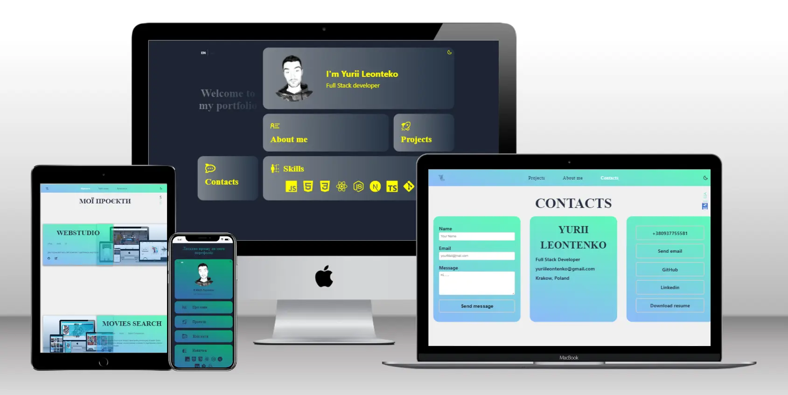

# Yurii Leontenko Portfolio

This is Yuriy Leontenko's multi-page portfolio website that
showcases projects and skills. You can use this template to
showcase your projects and provide contact information. The
website consists of the following pages:

- Home
- About Me
- Projects
- Contacts

## Preview



## Tech Stack

- **React:** A JavaScript library for building user
  interfaces.
- **Styled-components:** A CSS-in-JS library for styling
  React components.
- **Framer Motion:** A library for creating animations in
  React.
- **React Router DOM:** A library for routing in React
  applications.
- **React i18next:** A powerful internationalization
  framework for React applications.
- **Redux Toolkit:** An opinionated, batteries-included
  toolset for efficient Redux development.
- **EmailJS:** A service for sending emails using
  client-side technologies.

## Usage

1. Clone the repository:

   ```bash
   git clone https://github.com/YOUR_USERNAME/yurii-leontenko-portfolio.git
   ```

2. Install dependencies:

   ```bash
   cd yurii-leontenko-portfolio
   npm install
   ```

3. Run the development server:

   ```bash
   npm run dev
   ```

4. Open [http://localhost:3000](http://localhost:3000) to
   view it in the browser.

## Features

- Responsive and adaptive design for all devices.
- Multi-language support (English and Ukranian).
- Dynamic routing with React Router DOM.
- State management with Redux Toolkit.
- Localization with React i18next.
- Animated transitions using Framer Motion.

## Credits

This project was created by
[Yurii Leontenko](https://github.com/YuriiLeo).
